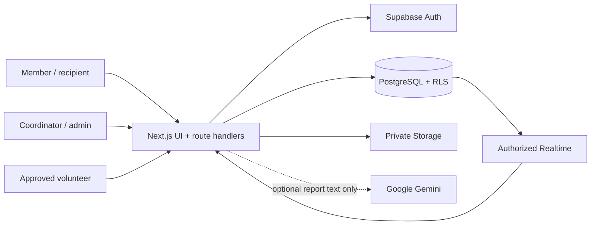

# Architecture

TrustGrid is one TypeScript application. Next.js renders public and protected interfaces and exposes route handlers; Supabase provides PostgreSQL, Auth, private Storage, and authorized Realtime changes.

## Boundaries

- `components/` contains shared presentation and interactive workflow components.
- `lib/domain/` contains deterministic allocation, evidence, inventory, matching, and task transition logic.
- `lib/server/handler.ts` maps authenticated HTTP requests to reads and the single transactional mutation RPC.
- `supabase/migrations/` defines the schema, RLS, storage rules, realtime publication, and security-definer functions.
- `tg_mutate` locks affected rows, checks active organization membership and role, applies version and idempotency guards, and writes the audit trail in the same transaction.

Every operational row carries an organization ID. Composite foreign keys prevent cross-organization references. RLS filters reads; regular clients cannot directly update protected state, stock balances, memberships, or audit records. Elevated functions revoke public/anonymous access, set an empty search path, use fully qualified identifiers, and re-check `auth.uid()` plus active membership.

The inventory ledger distinguishes offer, confirmed lot, reservation, pickup, receipt, return, and loss. Pickup subtracts physical stock once; receipt closes custody without subtracting stock again. Expired holds are rejected by business operations even before the scheduled cleanup runs.

The AI adapter accepts report text only, uses a JSON schema, validates cited snippets against the source, stores model/schema metadata, and cannot mutate the database. Invalid, timed-out, or unconfigured AI calls return the preserved structured form.

The production Vercel path was tested. The Dockerfile provides the Next.js standalone alternative; a hosted Supabase project remains required because plain PostgreSQL does not replace Auth, Storage, or Realtime.
